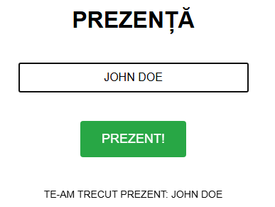

# Digital Attendance Tracker

A **minimal web app** for tracking student attendance in university courses.  
Students can check in themselves, even if they arrive late, and the data is automatically saved to a Google Sheet. Supports multiple courses with a single webpage.

---

## Features

- Two-course homepage with buttons to select the class.  
- Simple form for students to enter their name.  
- Names are automatically converted to uppercase.  
- Attendance is saved to a Google Sheet (one sheet per course).  
- Lightweight and easy to deploy.

---

## Setup

1. **Create a Google Sheet**  
   - Add a sheet for each course (e.g., `GRAPH`, `OOP`).  

2. **Create a Google Apps Script**  
   - Go to **Extensions → Apps Script** in your spreadsheet.  
   - Copy the `Code.gs` script (doPost) into the script editor.  

3. **Deploy the Web App**  
   - Click **Deploy → New Deployment → Web App**.  
   - Select **“Anyone” can access”**.  
   - Copy the Web App URL.

4. **Configure the frontend**  
   - In `script.js`, replace `SCRIPT_URL` with your Web App URL.  
   - Optional: customize course names in the `titles` object.  

5. **Host the frontend**  
   - You can use **GitHub Pages** or any static web host.  
   - Open `index.html` to start using the attendance form.

---

## Usage

1. Open the homepage.  
2. Select the course.  
3. Enter your name and click **PREZENT!**  
4. Attendance is logged to the corresponding Google Sheet.

---

## Notes

- The system does **not authenticate users**, so anyone with the link can submit.  
- Make sure your Google Sheet tabs match the course names in the script.  
- Optionally, you can implement authentication or validation for added security.