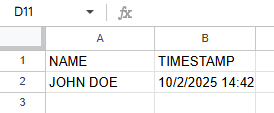

# Digital Attendance Tracker


A **minimal web app** for tracking student attendance in university courses.  
Students can check in themselves, even if they arrive late, and the data is automatically saved to a Google Sheet. Supports multiple courses with a single webpage.

---

## Stored Data

When students submit their attendance, it is recorded in the Google Sheet:



---

## Features

- Two-course homepage with buttons to select the class.  
- Simple form for students to enter their name.  
- Names are automatically converted to uppercase.  
- Attendance is saved to a Google Sheet (one sheet per course).  
- Lightweight and easy to deploy.

---

## Setup

1. **Create a Google Sheet**  
   - Add a sheet for each course (e.g., `GRAPH`, `OOP`).  

2. **Create a Google Apps Script**  
   - Go to **Extensions → Apps Script** in your spreadsheet.  
   - Copy the `Code.gs` script (doPost) into the script editor.  

3. **Deploy the Web App**  
   - Click **Deploy → New Deployment → Web App**.  
   - Select **“Anyone” can access”**.  
   - Copy the Web App URL.

4. **Configure the frontend**  
   - In `script.js`, replace `SCRIPT_URL` with your Web App URL.  
   - Optional: customize course names in the `titles` object.  

5. **Host the frontend**  
   - You can use **GitHub Pages** or any static web host.  
   - Open `index.html` to start using the attendance form.

## How to Add a New Course

The steps to add a new course are very simple:

### 1. Edit `config.js`

Add a new object to the `COURSES` collection with the following structure:

```javascript
5: {
   id: 5,
   name: "COURSE NAME",
   shortName: "ACRONYM",
   scriptUrl: "https://script.google.com/macros/s/YOUR_SCRIPT_URL/exec"
}
```

---

## Usage

1. Open the homepage.  
2. Select the course.  
3. Enter your name and click **PREZENT!**  
4. Attendance is logged to the corresponding Google Sheet.

---

## Notes

- The system does **not authenticate users**, so anyone with the link can submit.  
- Make sure your Google Sheet tabs match the course names in the script.  
- Optionally, you can implement authentication or validation for added security.

---

## Updates

####  2025/10/6
- Added daily attendance viewing functionality - students can now view who is present today
- Implemented modern dark theme with professional color scheme for better user experience and reduced eye strain

####  2025/10/8
- Restructured navigation flow with new course selection hub (materie.html)
- Replaced daily attendance view with comprehensive tabular attendance display (prezente.html)
- Enhanced Google Apps Script with doGet functionality for complete attendance data retrieval
- Improved course-specific routing and back navigation throughout the application
- Consolidated styling and removed unused components for cleaner codebase


####  2025/10/22
- Reorganized project into fully modular configuration-based architecture
- Created central `config.js` file for managing all course information in one place
- Implemented Course/Lab separation - each course now supports both course and lab attendance tracking
- Added segmented button groups for Course and Lab selection with visual differentiation (green/blue colors)
- Updated Google Apps Script to handle `type` parameter for routing between course and lab sheets
- Simplified deployment - adding new courses now only requires editing `config.js`
