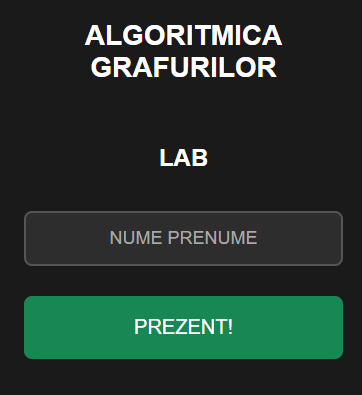
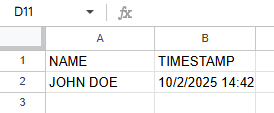

# Digital Attendance Tracker



A **minimal web app** for tracking student attendance in university courses.  
Students can check in themselves, even if they arrive late, and the data is automatically saved to a Google Sheet. Supports multiple courses with a single webpage.

---

## Stored Data

When students submit their attendance, it is recorded in the Google Sheet:



## Summary Table (dynamic)

Build a live, auto-expanding matrix of students (rows) vs dates (columns) with ✓ marks for presence.

Create a new sheet named `LABTABEL`, then add:

- Cell `A1`: `Nume`
- Cell `A2` (unique, sorted names):

```gs
=UNIQUE(SORT(LAB!A2:A))
```

- Cell `B1` (unique dates header):

```gs
=TRANSPOSE(UNIQUE(SORT(LAB!C2:C)))
```

- Cell `B2`:

```gs
=IF(COUNTIFS(LAB!$A:$A,$A2,LAB!$C:$C,B$1)>0,"✓","")
```

- Drag B2 formula for all the other cells that you want the checks to happen

If you have multiple tables, you can create an `ALL` table and use this formula in cell `A1`:
```gs
=LET(
  rempty, 1, 
  namesC, CURSTABEL!A2:A, 
  namesL, LABTABEL!A2:A,
  datesC, CURSTABEL!B1:1, 
  datesL, LABTABEL!B1:1,
  
  uNames, SORT(UNIQUE(TOCOL(VSTACK(namesC, namesL), rempty))),
  uDates, TRANSPOSE(SORT(UNIQUE(TOCOL(VSTACK(TRANSPOSE(datesC), TRANSPOSE(datesL)), rempty)))),
  
  populate, MAKEARRAY(ROWS(uNames), COLUMNS(uDates), LAMBDA(r, c, 
    LET(
      curName, INDEX(uNames, r),
      curDate, INDEX(uDates, c),
      checkLec, IFERROR(INDEX(CURSTABEL!A:Z, MATCH(curName, CURSTABEL!A:A, 0), MATCH(curDate, CURSTABEL!1:1, 0)), ""),
      checkLab, IFERROR(INDEX(LABTABEL!A:Z, MATCH(curName, LABTABEL!A:A, 0), MATCH(curDate, LABTABEL!1:1, 0)), ""),
      IF(checkLec<>"", checkLec, checkLab)
    )
  )),
  
  VSTACK(HSTACK("NAME", uDates), HSTACK(uNames, populate))
)
```
This will merge the two tables into one

---

## Features

- Config-driven homepage that lists all courses from `config.js` (add new courses without changing HTML).  
- For each course, choose CURS/LAB and either mark attendance or view attendance in a table.  
- One Apps Script URL per course; backend distinguishes CURS/LAB via `type=course|lab`.  
- Geolocation-based check-in with short best-fix sampling and accuracy-aware radius (optional, configurable).  
- Simple name form; names are auto uppercased and sanitized (supports Romanian diacritics).  
- Full attendance viewer (dates as columns, ✓ marks per student).  
- Responsive dark theme; lightweight static hosting (GitHub Pages friendly).

---

## Setup

1. **Create a Google Sheet**  
   - Add a sheet for course and laboratory (e.g., `CURS`, `LAB`).  

2. **Create a Google Apps Script**  
   - Go to **Extensions → Apps Script** in your spreadsheet.  
   - Copy the `Code.gs` script (doPost) into the script editor.  

3. **Deploy the Web App**  
   - Click **Deploy → New Deployment → Web App**.  
   - Select **“Anyone” can access”**.  
   - Copy the Web App URL.

4. **Configure the frontend**  
   - Open `config.js` and set `scriptUrl` for each course to your Web App URL (one URL per course handles both CURS/LAB).  
   - Update the course `name` (and optional `shortName`) in `config.js` as you want it displayed.  
   - Optional: adjust geolocation by setting `CAMPUS.lat`, `CAMPUS.lon` and `radiusMeters` in `config.js`.  

5. **Host the frontend**  
   - You can use **GitHub Pages** or any static web host.  
   - Open `index.html` to start using the attendance form.

## How to Add a New Course

The steps to add a new course are very simple:

### 1. Edit `config.js`

Add a new object to the `COURSES` collection with the following structure:

```javascript
6: {
   id: 6,
   name: "COURSE NAME",
   shortName: "ACRONYM",
   scriptUrl: "https://script.google.com/macros/s/YOUR_SCRIPT_URL/exec"
}
```

---

## Usage

1. Open the homepage.  
2. Select the course.  
3. Enter your name and click **PREZENT!**  
4. Attendance is logged to the corresponding Google Sheet.
5. Be sure to have location turned on!

---

## Notes

- The system does **not authenticate users**, so anyone with the link can submit.  
- Make sure your Google Sheet tabs match the course names in the script.  
- Optionally, you can implement authentication or validation for added security.

---

## Updates

####  2025/10/6
- Added daily attendance viewing functionality - students can now view who is present today
- Implemented modern dark theme with professional color scheme for better user experience and reduced eye strain

####  2025/10/8
- Restructured navigation flow with new course selection hub (materie.html)
- Replaced daily attendance view with comprehensive tabular attendance display (prezente.html)
- Enhanced Google Apps Script with doGet functionality for complete attendance data retrieval
- Improved course-specific routing and back navigation throughout the application
- Consolidated styling and removed unused components for cleaner codebase


####  2025/10/22
- Reorganized project into fully modular configuration-based architecture
- Created central `config.js` file for managing all course information in one place
- Implemented Course/Lab separation - each course now supports both course and lab attendance tracking
- Added segmented button groups for Course and Lab selection with visual differentiation (green/blue colors)
- Updated Google Apps Script to handle `type` parameter for routing between course and lab sheets
- Simplified deployment - adding new courses now only requires editing `config.js`

####  2026/02/01
- Added student name autocomplete functionality with searchable dropdown suggestions
- Implemented name matching from STUDENTS list in config.js to reduce attendance data mismatches
- Added ENABLE_AUTOCOMPLETE toggle in config.js for easy enable/disable without app changes
- Student names are alphabetically sorted and filtered in real-time as users type
- Implemented vertical date headers on prezente.html to maximize screen space for attendance checkmarks
- Date headers now display vertically (rotated 90 degrees) instead of horizontally to reduce horizontal scrolling